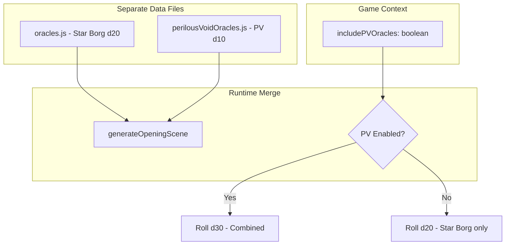

# Perilous Void Oracle Integration (with Runtime Toggle)

## Architecture

Keep data separate, merge at runtime based on user setting:

## Implementation

### 1. Create `src/data/perilousVoidOracles.js`

Isolated file with:

- `pvOpeningScenes` - 10 entries with `{ incident, followUpQuestions }`
- `pvIncitingIncidents` - 10 entries with same structure
- `generatePVIncitingIncident()` function
- Source attribution comments

### 2. Add toggle to GameContext

Update [GameContext.jsx](src/context/GameContext.jsx):

- Add `includePVOracles` to game state (default: true)
- Add `togglePVOracles()` action
- Persist to localStorage with other settings

### 3. Create unified opening scene generator in oracles.js

Update [oracles.js](src/data/oracles.js):

- New export: `generateOpeningScene(includePV = true)`
- If `includePV`: roll d30, entries 1-20 from Star Borg, 21-30 from PV import
- If not: roll d20, Star Borg only
- Returns `{ roll, result }` or `{ roll, incident, followUpQuestions, source }` for PV entries

### 4. Add Inciting Incident to MissionGenerator

Update [MissionGenerator.jsx](src/components/oracles/generators/MissionGenerator.jsx):

- Add "Inciting" tab (only visible when PV enabled)
- Import `generatePVIncitingIncident` from perilousVoidOracles.js

### 5. Update display components

Add rendering for `result.incident && result.followUpQuestions` in:

- [OracleResultDisplay.jsx](src/components/oracles/OracleResultDisplay.jsx)
- [CompactOracleResult.jsx](src/components/oracles/CompactOracleResult.jsx)

### 6. Update consumers

**GameFlowDrawer.jsx:**

- Import `useGame` to get `includePVOracles` setting
- Pass setting to `generateOpeningScene()`

**OracleCompendium.jsx:**

- Update Opening Scene table to show d20 or d30 based on toggle
- Consider showing toggle UI here or in a settings area

### 7. Add toggle UI

Add checkbox/toggle in Header settings or Oracle Compendium:

- "Include Perilous Void Oracles"
- Controls `includePVOracles` in GameContext

## Modularity

To fully remove Perilous Void:

1. Delete `perilousVoidOracles.js`
2. Remove import and PV logic from `generateOpeningScene()`
3. Remove toggle from GameContext and UI
4. Remove Inciting tab from MissionGenerator

To temporarily disable: Just toggle off in UI.