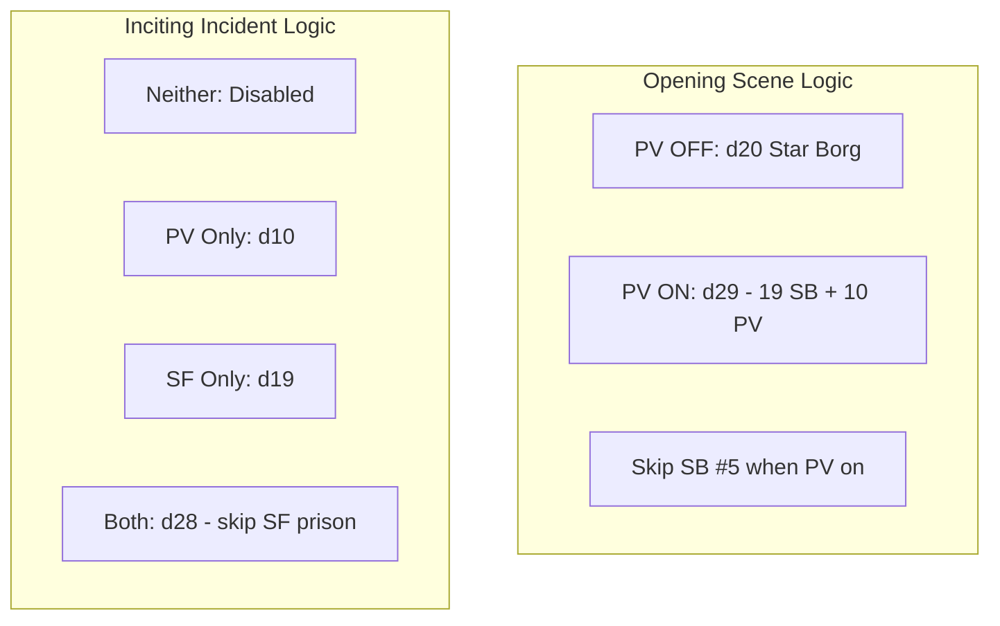

# Starforged Integration + Smart Duplicate Handling

## Duplicate Handling Strategy

**Opening Scenes:**

- Star Borg #5 "Bounty Hunter chase" ≈ PV #6 "Hot Pursuit"
- **Solution**: When PV enabled, exclude Star Borg #5, use PV's version with follow-up questions
- PV OFF: d20 (all Star Borg)
- PV ON: d29 (19 Star Borg + 10 PV)

**Inciting Incidents:**

- PV "Prison Break" ≈ Starforged "Liberate prisoners at labor camp"
- **Solution**: When PV enabled, exclude SF's duplicate
- Neither: disabled
- PV only: d10
- SF only: d19 (all unique)
- Both: d28 (10 PV + 18 SF, excluding prison break)



## Starforged Entries (19 total - only "Liberate prisoners" removed)

1. Aid a starship caught in a spacetime fracture
2. Broker peace between two feuding settlements
3. Chart a new passage between isolated settlements
4. Defend the people of a beleaguered settlement against raiders
5. Discover who sabotaged a settlement's air processors
6. Escort a tradeship carrying prized cargo
7. Ferry a rescue team to a perilous disaster site
8. Infiltrate a fortified base to steal crucial data
9. Investigate terrifying manifestations at a remote settlement
10. Locate a downed spacer on an uninhabited planet
11. Protect a fugitive from a relentless bounty hunter
12. Recover a cherished pre-exodus artifact from an enemy
13. Rescue a starship crew held captive by mutineers
14. Retrieve a cache of stolen weapons from a pirate ship
15. Sabotage an enemy installation
16. Search for a missing expedition in the depths of a precursor vault
17. Shield a wondrous lifeform from those who seek to destroy it
18. Track and slay a marauding beast
19. Transport a displaced people to their new home

## Implementation Steps

### 1. Create Starforged Data File

**File**: `src/data/starforgedOracles.js`

- 19 inciting incidents (simpler format, no follow-up questions)
- Mark which entry is the "prison break" duplicate for filtering
- Generator function

### 2. Add Starforged Toggle to GameContext

**File**: `src/context/GameContext.jsx`

```javascript
includeStarforgedOracles: true,
toggleStarforgedOracles(enabled)
```

### 3. Update SettingsDrawer

**File**: `src/components/layout/SettingsDrawer.jsx`

Add Starforged toggle in Content Sources:

- Checkbox with "Starforged" label  
- Description: "Adds 19 inciting incidents for campaign setup"
- ACTIVE badge when enabled

### 4. Update Opening Scene Generator

**File**: `src/data/oracles.js`

Update `generateOpeningScene(includePV)`:

```javascript

// When PV enabled, skip Star Borg entry #5 (index 4) - it's a duplicate

const starBorgScenes = includePV

? soloOracles.openingScene.filter((_,