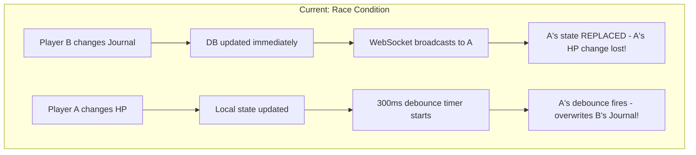
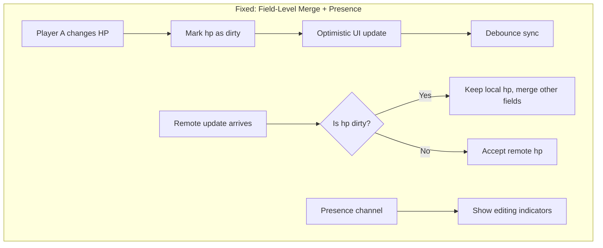

# WebSocket Real-time Infrastructure Migration

## Problem Analysis

The current implementation has Supabase Realtime channels set up, but suffers from critical sync issues:

1. **Race Condition in GameContext** (lines 117-119, 140-176): When a remote update arrives via WebSocket, it completely replaces local state with `setGameState(payload.new.game_state)`. If the local user has pending debounced changes, they either get lost or overwrite the incoming remote update.

2. **No Debouncing in CharacterContext**: Every field change triggers an immediate HTTP `.update()` call with no batching or conflict protection.

3. **No Presence System**: Players cannot see who is actively editing shared fields, leading to "last write wins" overwrites.

4. **CharacterJournal Conflict Risk**: The 2000ms debounce creates a large window for concurrent edits to overwrite each other.



## Solution Architecture



---

## Phase 1: Database Configuration

First, check which tables already have realtime enabled:

```sql
-- Check current realtime tables
SELECT * FROM pg_publication_tables WHERE pubname = 'supabase_realtime';
```

Then run this SQL in Supabase SQL Editor (skip any ADD TABLE that already exists):

```sql
-- Enable realtime for tables NOT already members (run individually, skip if error)
-- ALTER PUBLICATION supabase_realtime ADD TABLE sessions;  -- SKIP if already member
-- ALTER PUBLICATION supabase_realtime ADD TABLE characters; -- SKIP if already member
-- ALTER PUBLICATION supabase_realtime ADD TABLE rooms;      -- Run if needed

-- Add updated_at column for optimistic locking (safe to run - IF NOT EXISTS)
ALTER TABLE sessions ADD COLUMN IF NOT EXISTS updated_at TIMESTAMPTZ DEFAULT NOW();
ALTER TABLE characters ADD COLUMN IF NOT EXISTS updated_at TIMESTAMPTZ DEFAULT NOW();

-- Create trigger function to auto-update timestamp (safe to run - OR REPLACE)
CREATE OR REPLACE FUNCTION update_timestamp()
RETURNS TRIGGER AS $$
BEGIN
  NEW.updated_at = NOW();
  RETURN NEW;
END;
$$ LANGUAGE plpgsql;

-- Create triggers (use DROP IF EXISTS + CREATE to be idempotent)
DROP TRIGGER IF EXISTS sessions_updated_at ON sessions;
CREATE TRIGGER sessions_updated_at BEFORE UPDATE ON sessions
  FOR EACH ROW EXECUTE FUNCTION update_timestamp();

DROP TRIGGER IF EXISTS characters_updated_at ON characters;
CREATE TRIGGER characters_updated_at BEFORE UPDATE ON characters
  FOR EACH ROW EXECUTE FUNCTION update_timestamp();
```

**Note:** The error `relation "sessions" is already member of publication "supabase_realtime"` means realtime is already enabled for that table - this is good! Just skip that line and continue with the rest.

---

## Phase 2: Refactor GameContext with Field-Level Merging

**File:** [`src/context/GameContext.jsx`](src/context/GameContext.jsx)

Key changes:

- Track "dirty fields" that have local pending changes
- On remote update, merge fields instead of replacing entire state
- Only accept remote values for fields not currently being edited locally
```javascript
// New approach pseudocode
const dirtyFieldsRef = useRef(new Set());

// On local change
dirtyFieldsRef.current.add('threatDie');
setGameState(prev => ({ ...prev, threatDie: 3 }));

// On remote update
const mergedState = { ...localState };
Object.keys(remoteState).forEach(key => {
  if (!dirtyFieldsRef.current.has(key)) {
    mergedState[key] = remoteState[key]; // Accept remote
  }
});

// After successful sync
dirtyFieldsRef.current.clear();
```


---

## Phase 3: Add Presence System

**New File:** `src/hooks/usePresence.js`

Implement Supabase Presence to track:

- Which users are in the room
- Which fields each user is actively editing
```javascript
// Usage example
const { presenceState, trackEditing, stopEditing } = usePresence(roomCode);

// In CharacterSheetDrawer
<input
  onFocus={() => trackEditing('motivation')}
  onBlur={() => stopEditing('motivation')}
  disabled={presenceState.motivation && presenceState.motivation !== myUserId}
/>
{presenceState.motivation && <span>Editing: {userName}</span>}
```


---

## Phase 4: Refactor CharacterContext with Debouncing

**File:** [`src/context/CharacterContext.jsx`](src/context/CharacterContext.jsx)

Changes:

- Add debounced updates (similar to GameContext pattern)
- Track dirty fields to prevent remote overwrites
- Use `updated_at` for optimistic locking

---

## Phase 5: Update UI Components

**Files to modify:**

- [`src/components/character/CharacterSheetDrawer.jsx`](src/components/character/CharacterSheetDrawer.jsx) - Add presence indicators
- [`src/components/character/CharacterJournal.jsx`](src/components/character/CharacterJournal.jsx) - Add editing lock
- [`src/components/character/PartyMemberCard.jsx`](src/components/character/PartyMemberCard.jsx) - Show who is editing

---

## Implementation Priority

| Priority | Task | Impact |

|----------|------|--------|

| P0 | GameContext field-level merging | Fixes core state conflicts |

| P0 | CharacterContext debouncing | Reduces DB load + prevents overwrites |

| P1 | Presence system | Prevents concurrent edits |

| P2 | UI presence indicators | Better UX |

| P3 | Conflict resolution modal | Edge case handling |

---

## Files to Create/Modify

| File | Action |

|------|--------|

| `migrations/enable_realtime.sql` | Create - SQL for Supabase |

| `src/hooks/usePresence.js` | Create - Presence hook |

| `src/context/GameContext.jsx` | Major refactor |

| `src/context/CharacterContext.jsx` | Major refactor |

| `src/components/character/CharacterSheetDrawer.jsx` | Add presence UI |

| `src/components/character/CharacterJournal.jsx` | Add edit locking |